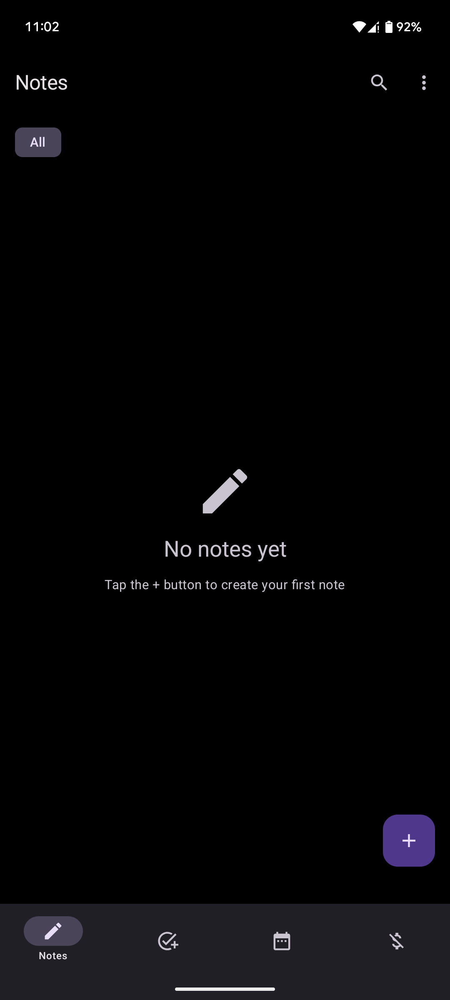
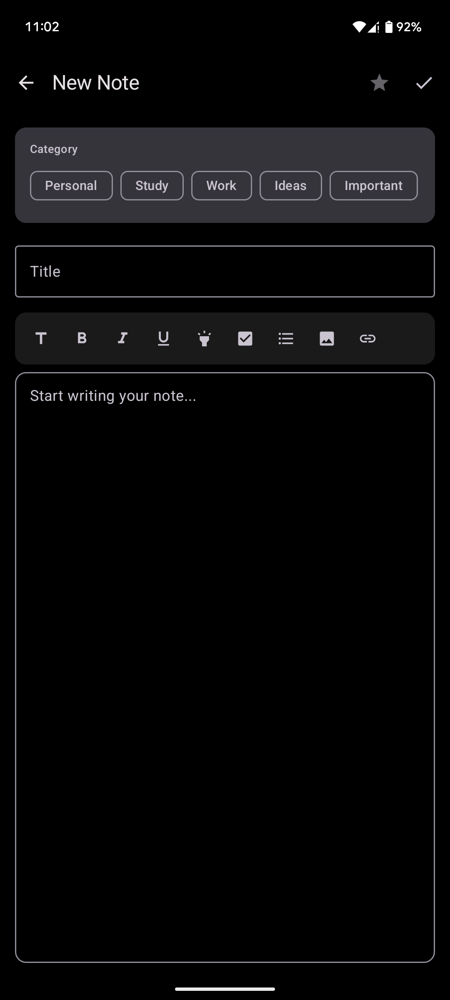
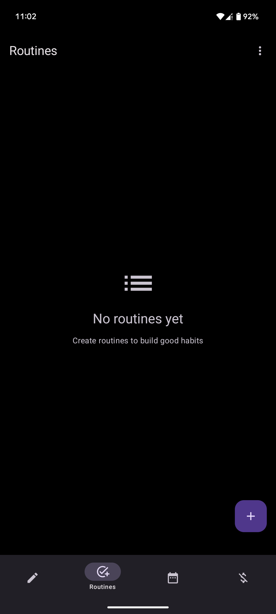
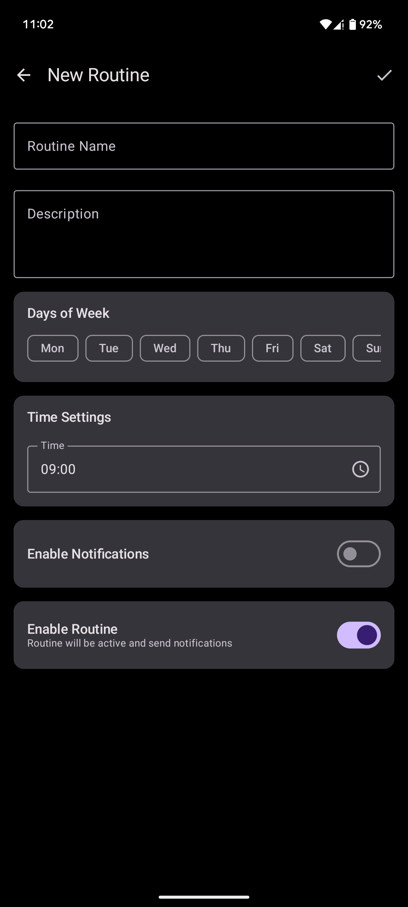
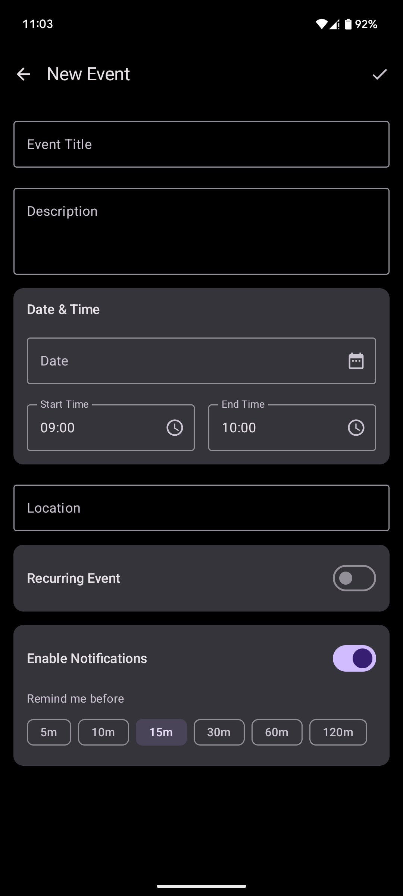
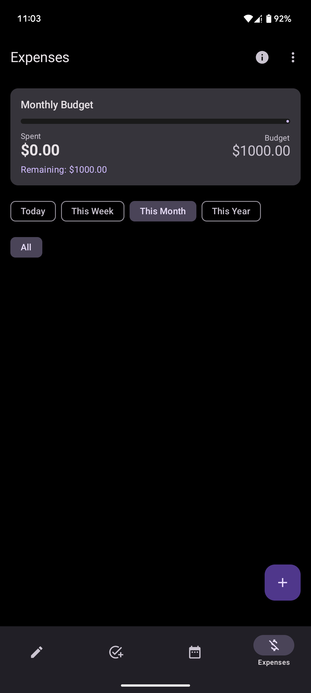
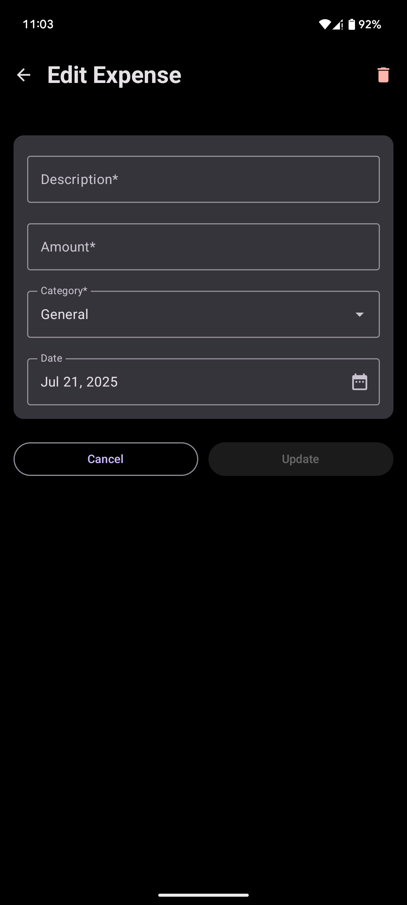

# Not Another Notes App

### An Android App That Does More And Takes Notes

### General UI

* Material You (Material Design 3) adaptive theming.
* AMOLED dark theme (true black backgrounds for battery efficiency).
* Used material-design-icons.

###  Screenshots

 

### Navigation Structure

* **Bottom navigation bar** with four main sections:
    * Notes
    * Routines
    * Schedules
    * Expenses

---

### Notes

* Rich Text Editing
* Media Support
* Search functionality.
* Note categories/labels.
* Archive for temporarily hiding notes.
* Recycle bin for recovering deleted notes.

### Routines

* Create daily or weekly routines.
* Configurable reminders for routines.
* Notification feedback for completion.
* Progress tracking for routine completion.
* Daily/weekly statistics.

### Schedules
* Create time-based schedules/events.
* Pin/unpin important schedule items.
* Calendar view (daily, weekly, monthly).
* Configurable alerts before scheduled events.
* Recurring schedule support.
  
### Expenses

* Track individual expenses with amount, date, and description
* Categorize expenses with customizable categories
* Monthly summary view
* Budget Management
* Track spending against budget
* Alerts for approaching budget limits
  
---

## Technical Implementation

* **Architecture Components**: Use of **ViewModel** and **LiveData** for UI data management.
* **Room database** for persistent storage.
* **WorkManager** for background tasks and scheduled operations.
* **DataStore** for preferences storage.
* **Navigation component** for in-app navigation.
